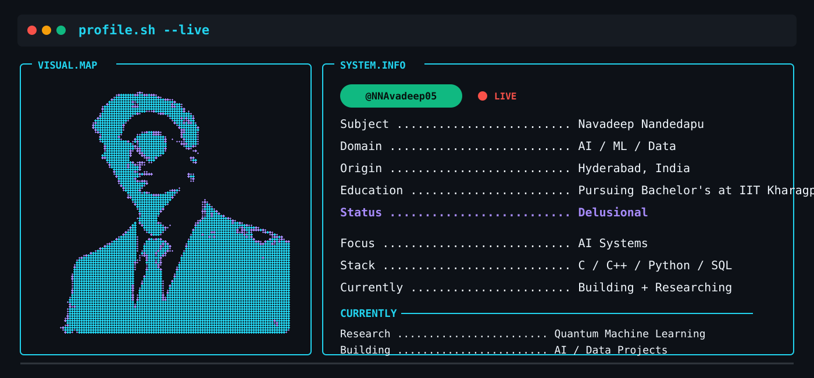

  

 

<h2 align="center">CONTRIBUTION.STATS</h2>

  

 

<h2 align="center">CONTRIBUTION.MAP</h2>

  

 

<h2 align="center">SOCIALS.MAP</h2>

  <a href="mailto:navadeepnandedapu@gmail.com">
    ✉️ Email
  </a>
  &nbsp;&nbsp;&nbsp;&nbsp;&nbsp;
  <a href="https://www.linkedin.com/in/navadeep-nandedapu/">
    💼 LinkedIn
  </a>
  &nbsp;&nbsp;&nbsp;&nbsp;&nbsp;
  <a href="https://github.com/NNavadeep05">
    🐙 GitHub
  </a>
  &nbsp;&nbsp;&nbsp;&nbsp;&nbsp;
  <a href="https://nnavadeep05.github.io/">
    🌐 Portfolio
  </a>

